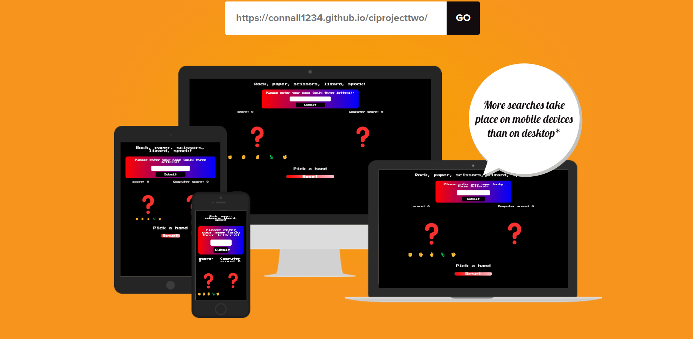
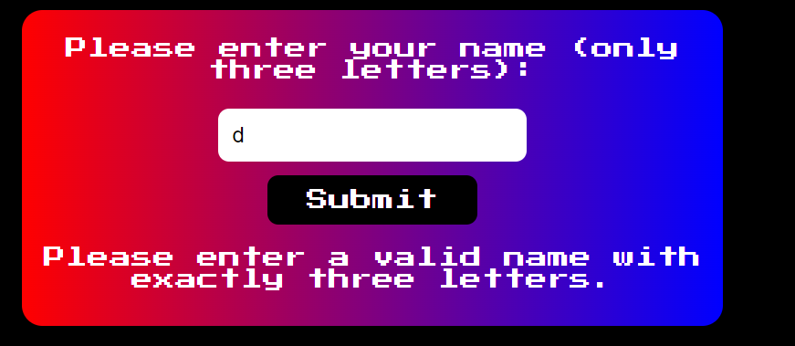
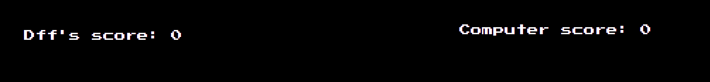
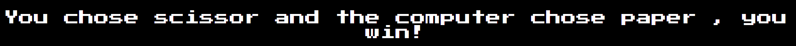
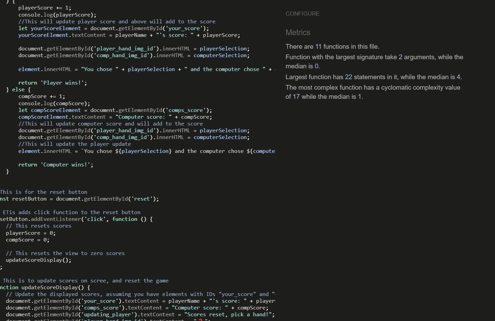
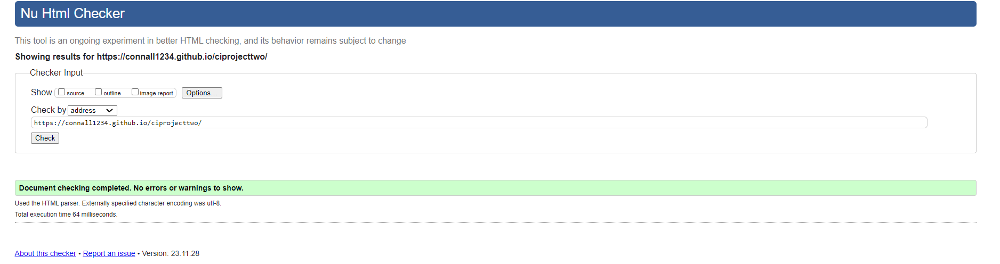
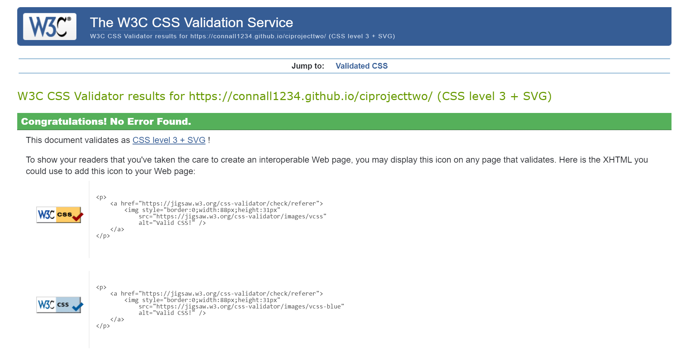
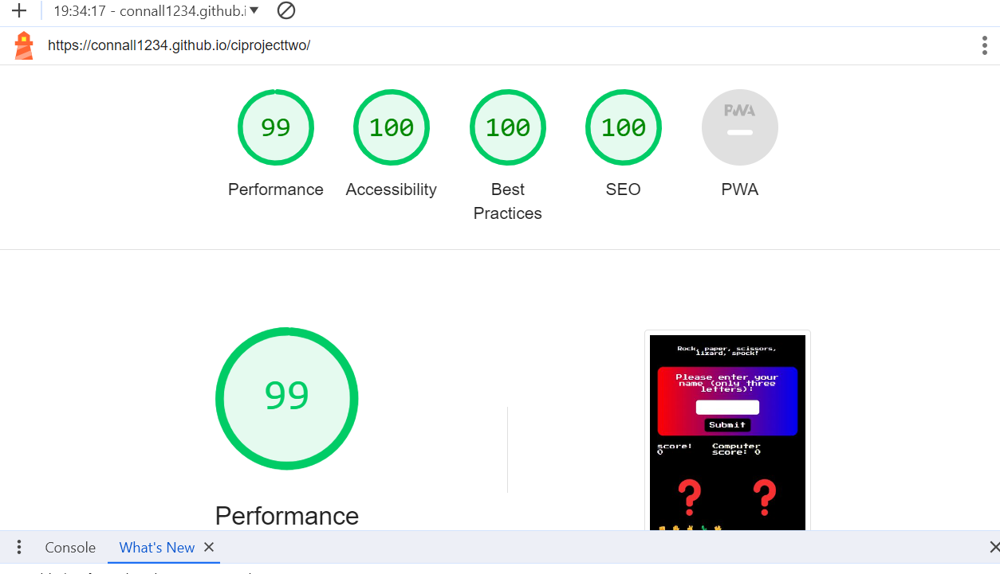

# Rock, Paper, Scissors, Lizard, Spock Game

Link to the site! [Pblished site](https://www.youtube.com/).

## Introduction

I've created a game that allows users to enjoy a classic from the show "Big Bang Theory." This game includes all the iconic options from the series, allowing you to play against a computer, set your name, view your score, and reset if the computer is winning too much! The aim was to deliver snappy gameplay and simplicity to the user.

## Features

### Pick a Name

This section allows users to pick a name, adding personality to the game. Users are limited to a three-letter name, aligning with the arcade theme.

### Score counter

This section allows users to pick a name, adding a way to keep track of the score for the user, the benefit of this is that the user can know if they won overall

### Choices

All game choices for the player are listed here. Additionally, there's a transition effect that scales up the choices when selected.

### The VS Feature

This feature displays your choice in a larger scale, allowing you to see your selection alongside the computer's choice.

### Updating the Player

This element updates the player, providing direction and keeping them informed about the game's progress.

### Reset Button

The reset button allows players to reset the score without reloading the page.

## User Experience (UX)

### User Stories

- **First Time Visitor Goals**
  - As a first-time visitor, I want to easily understand the page I am on and what to do.
    - When a user joins the site, they will instantly see a website with a box asking for a name, with instructions, and then see the emojis below for their choices.
    - After entering the name, everything you need for the game will be right in front of you.
    - The user can click one of the emojis and see what the computer picks, there is also an update bar so the user knows exactly what is going on, alongside a reset button.
  - As a first-time visitor, I want to easily understand what game I am playing.
    - When the user joins the site, they will be greeted with a title of Rock, paper, scissors, lizard, Spock. Alongside all the choices to pick, and an update bar giving them instructions to pick a hand.
  - As a first-time visitor, I want to play the game without much guidance and intuitively understand the game.
    - When the visitor joins the page they can see all the relevant parts to the page, and can navigate their way through, also, if they do not know what to do the update bar will give them guidance.

- **Returning Visitor Goals**
  - As a returning visitor, I want to play the game without any need to figure out how the game works or what to interact with.
    - Quick response times and fast interaction from inputs give this element to the game.
    - Making sure there is no lag between the player input and the expected output makes the game satisfying to play.
  - As a returning visitor, I want to play the game on multiple different devices.
    - The website was viewed on a variety of devices, like desktop, laptop, tablet, and multiple phones.
    - A lot of testing was done to ensure that all functions work properly.
    - My family and friends were asked to review the project and make note of any bugs they found.

- **Frequent User Goals**
  - As a frequent user, I want to have the game feel responsive when I play it.
    - Quick response times and fast interaction from inputs give this element to the game.
    - Making sure there is no lag between the player input and the expected output makes the game satisfying to play.
  - As a frequent user, I want to use the reset feature to reset the scores.
    - The reset button placed where the player can easily see it will accomplish this.
    - Clear guidance on the page along with the reset button gives all elements their purpose.

### Design

- **Colour Scheme**
  - The colours used were black and white, for a simple contrast, and also red for the reset button to give the arcade theme.
- **Typography**
  - The font is 'Press Start 2P', sans-serif; this is to keep with the arcade feel, and I have sans-serif as the backup.
- **Imagery**
  - There is no need for imagery in this game, as we use emojis to represent our handpicks.

### Wireframes

- Wireframe [Wireframe](assets/images/wireframescsht.png).

## Technologies Used

- **Languages Used**
  - HTML5
  - CSS3
  - JavaScript
  - GitHub

## Testing

- **Validators and JSHint**
  - 
  - 
  - 
  - No errors were encountered during testing.

- **Cross-browser and Device Testing**
  - The website was tested across Google Chrome, Internet Explorer, Microsoft Edge, and Safari browsers.
  - It was also viewed on various devices like Desktop, Laptop, iPhone7, iPhone 8, and iPhoneX.
  - Extensive testing ensured proper linking and responsiveness.

- **Lighthouse**
  - 
  - The project scored high in the Lighthouse feature.

## Deployment

### GitHub Pages

The project was deployed to GitHub Pages using the following steps:

1. Log in to GitHub and access the [GitHub Repository](https://www.youtube.com/).
2. Go to Settings > GitHub Pages > Source > Select "Master Branch."
3. The published site can be accessed [here](https://www.youtube.com/).

### Forking the GitHub Repository

Forking the repository creates a copy on your GitHub account for viewing and/or making changes without affecting the original repository. Follow these steps:

1. Access the [GitHub Repository](https://www.youtube.com/).
2. Click "Fork" at the top right of the repository.

### Making a Local Clone

To clone the repository locally, follow these steps:

1. Access the [GitHub Repository](https://www.youtube.com/).
2. Click "Clone or download" and copy the URL under "Clone with HTTPS."
3. Open Git Bash and navigate to the desired directory.
4. Enter `git clone` followed by the copied URL.

## Credits

I'd like to credit my mentor and Code Institute for their invaluable support and guidance.
I would like to credit the below video for the idea to use emojis - <https://www.youtube.com/watch?v=1yS-JV4fWqY&t=728s>
I would like to credit ChatGPT for help with a CSS error and a JavaScript query
